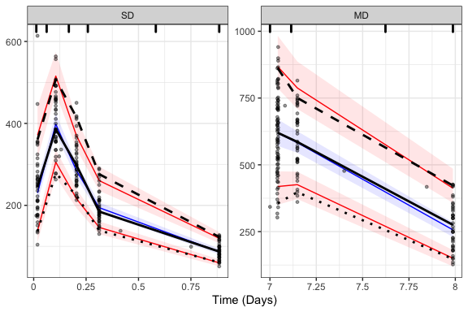

# Setup


```r
knitr::opts_chunk$set(echo = TRUE, fig.width=6, fig.height=4)
knitr::opts_knit$set(root.dir = rprojroot::find_rstudio_root_file())

library(tidyverse)
library(glue)
library(xpose)
library(mrgsolve)
library(xgxr)
library(tidyvpc)

theme_set(theme_linedraw(base_size = 12))

geomean <- function(x){exp(mean(log(x)))}
quibble <- function(x, q = c(0.05, 0.5, 0.95)) {
  tibble("{{ x }}" := quantile(x, q), 
         "{{ x }}_q" := paste0("P",
                               formatC(q * 100, width = 2, format = "d", flag = "0")))
}
# summarize(data, quibble(x))
```


# Preface

See <https://github.com/Genentech/mrgsolve_replace_NMsim> for the code & files needed to run the examples in your environment

## `mrgsolve` applications covered in this document

In this file, the following four types of `mrgsolve` applications has been demonstrated:

- Draw smooth PK profiles by adding observation time points in simulations
- Clinical trial simulation with new dose amount and schedules
- Obtain summary PK metrics (e.g. AUC<sub>ss</sub>, C<sub>min,ss</sub>, C<sub>min,ss</sub>) based on protocol-defined dosing schedules and empirical Bayes estimates (EBE) of individual ETA
  - This is useful for generating metrics for E-R analysis
- VPC


## Notes

- The model & data were from:
  - *Nonlinear Mixed‐Effects Model Development and Simulation Using nlmixr and Related R Open‐Source Packages*, Fidler et al., CPT Pharmacometrics Syst Pharmacol. 2019 Sep;8(9):621-633.
  - https://doi.org/10.1002/psp4.12445
- `mrgsolve` version >= 0.10.4 is required
- In these workflows, THETA (& SIGMA) is updated with values in input data frames, while OMEGA is updated with omat function to be applied on `mrgmod` object

# Preparations

## CSV data import
### First modify data

examplomycin.csv is obtained from Supplementary File 1 of the above article  
Modification needed to be compatible with NONMEM  


```r
df.raw <- read_csv("data/examplomycin.csv")

unique(df.raw$EVID)

df.raw %>% 
  mutate(CMT = ifelse(EVID == 101, 1, 2),
         EVID = ifelse(EVID == 101, 1, 0),
         PHASE = ifelse(TIME < 24, "SD", "MD")) %>% 
  relocate(CMT, .after = DV) %>% 
  rename(NMID = ID) %>% 
  write_csv("data/examplomycin2.csv")
```

### Import modified data


```r
df.nm <- read_csv("data/examplomycin2.csv")
```

```
## Parsed with column specification:
## cols(
##   NMID = col_double(),
##   TIME = col_double(),
##   DV = col_double(),
##   CMT = col_double(),
##   WT = col_double(),
##   SEX = col_double(),
##   AMT = col_double(),
##   EVID = col_double(),
##   PHASE = col_character()
## )
```

```r
df.nm.dose<- filter(df.nm, EVID == 1)
df.nm.obs <- filter(df.nm, EVID == 0)

time_units_dataset = "hours"
time_units_plot    = "days"
```

## Load model files

### `mrgsolve`


```r
mod_pk <- mread("mrgsolve/examplomycin_2cmt_covs_2020-07-08.cpp")
```

```
## Building examplomycin_2cmt_covs_2020-07-08_cpp ... done.
```

```r
see(mod_pk)
```

```
## 
## Model file:  examplomycin_2cmt_covs_2020-07-08.cpp 
## [PROB]
## Source: mrgsolve model library
## 
## Two-compartment model for oral dosing 
## 
## Comment:  
## Time unit: hour
## Volume units: L
## 
## [GLOBAL]
## #define C2 (CENT / V2) 
## 
## [CMT] @annotated
## DEPOT  : Extravascular compartment
## CENT   : Central compartment
## PERIPH : Peripheral compartment (mass) 
## AUCCENT: AUC in the central compartment
## 
## [PARAM] @annotated
## TVCL   :  0.1 : Clearance (L/hour)
## TVV2   :  2    : Central volume of distribution (L)
## TVV3   :  5    : Peripheral volume of distribution (L)
## TVQ    :  0.3  : Inter-compartmental clearnace (L/hour)
## TVKA   :  1    : Absorption rate constant (1/hour)
## TVALAG1:  0    : Lag time - EV dose
## WT     : 70    : Individual weight (kg)
## WTref  : 70    : Reference body weight (kg)
## WTCL   :  0.75 : Effect of WT on CL
## SEX    :  0    : 1 = male, 0 = female
## SEXV2  : -0.2  : Effect of SEX=1 (male) on central compartment volume
## PROP   :  0.1  : Proportional error (SD)
## ADD    :  0    : Additive error (SD)
## 
## // ETA for sim with EBE
## E_CLi : 0 : ETA on CL 
## E_V2i : 0 : ETA on V2
## E_V3i : 0 : ETA on V3
## E_Qi  : 0 : ETA on Q
## E_KAi : 0 : ETA on KA
##   
## [OMEGA] @annotated @block @name group1
## // note: if you want to enter off-diagonal elements as correlations, add "@correlation" to this block
## E_CL : 0.1       : ETA on CL
## E_V2 : 0.03  0.1 : ETA on V2
## 
## [OMEGA] @annotated @name group2
## E_V3   : 0.1  : ETA on V3
## E_Q    : 0.1  : ETA on Q
## E_KA   : 0.1  : ETA on KA
## 
## [SIGMA] 1
## 
## [MAIN]
## // covariate effects on parameters
## double CLCOV = pow(WT/WTref, WTCL);
## double V2COV = exp(SEXV2 * SEX);
## 
## double CL   = TVCL * CLCOV * exp(E_CL + E_CLi);
## double V2   = TVV2 * V2COV * exp(E_V2 + E_V2i); 
## double V3   = TVV3 * exp(E_V3 + E_V3i);
## double Q    = TVQ  * exp(E_Q  + E_Qi);
## double KA   = TVKA * exp(E_KA + E_KAi); 
## 
## double K   = CL/V2;
## double K23 = Q/V2;
## double K32 = Q/V3;
## 
## ALAG_DEPOT = TVALAG1;
## 
## [ODE]
## dxdt_DEPOT  =-KA*DEPOT;
## dxdt_CENT   = KA*DEPOT - (K+K23)*CENT + K32*PERIPH;
## dxdt_PERIPH =               K23 *CENT - K32*PERIPH;
## 
## dxdt_AUCCENT= C2;
## 
## [TABLE]
## 
## double IPRED = C2;
## double SD = sqrt(PROP*PROP*IPRED*IPRED + ADD*ADD);
## double DV = IPRED + EPS(1) * SD;
## 
## [CAPTURE] @annotated
## IPRED : Concentration without residual variability
## DV    : Concentration with residual variability 
##   
## [CAPTURE] E_CL E_V2 E_V3 E_Q E_KA CL V2
```


### NONMEM fit

This is needed to extract population parameter estimates (THETA, OMEGA) as well as individuals (ETA).  

Alternatively you can manually modify population parameters in the `mrgsolve` model file.  
For ETA you most likely need to load NONMEM fit (unless you get EBE using R).  


```r
xpdb <- xpose_data(runno = "006", dir = "nm")
```

```
## Warning: Duplicated column names deduplicated: 'DV' => 'DV_1' [21]
```

```r
df.theta <- 
  get_prm(xpdb, transform = FALSE, quiet = TRUE) %>% 
  filter(type == "the") %>% 
  select(name, value) %>% 
  pivot_wider() %>% 
  rename(TVCL = THETA1,
         TVV2 = THETA2,
         TVV3 = THETA3,
         TVQ  = THETA4,
         TVKA = THETA5,
         PROP = THETA6,
         ADD  = THETA7,
         WTCL = THETA11,
         SEXV2= THETA12)

df.eta <- 
  get_data(xpdb, quiet = TRUE) %>% 
  select(NMID, 
         E_CLi = ETA1, 
         E_V2i = ETA2, 
         E_V3i = ETA3, 
         E_Qi  = ETA4, 
         E_KAi = ETA5) %>% 
  distinct()

omega.vec <- 
  get_prm(xpdb, transform = FALSE, quiet = TRUE) %>% 
  filter(type == "ome") %>% 
  pull(value)

d.omat <- 
  omat(group1 = bmat(omega.vec[1:3]), group2 = dmat(omega.vec[4:6]))
```


# Draw smooth individual PK curve

See https://mrgsolve.github.io/user_guide/topics.html#topic-designs for more details of specifying sampling designs

## Run


```r
# Set-up datasets
df.sim.act.dose <-
  df.nm %>% 
  # Add parameter values
  expand_grid(df.theta) %>% 
  mutate(ID = NMID)

df.sim.act.dose.eta <-
  df.nm %>% 
  # Add parameter and ETA values
  expand_grid(df.theta) %>% 
  left_join(df.eta, by = "NMID") %>% 
  mutate(ID = NMID)

# Model run setting
mod_pk.act.dose <- 
  mod_pk %>% 
  # Set Omega and Sigma to zero
  zero_re() %>% 
  # Keep these variables in the output
  # a.u.g is a flag for augmented sampling timepoints
  carry_out(NMID, AMT, EVID, WT, SEX, a.u.g) %>% 
  # Specify that we want to add augmented timepoints (defined with delta)
  obsaug()


# PRED 
## IPRED in output here is PRED because E_XXi is left at 0 and 
## SIGMA and OMEGA were also set as 0
mrgsim.pred.act.dose <- 
  mod_pk.act.dose %>% 
  data_set(df.sim.act.dose) %>%
  mrgsim(end = 200, delta = 1,
         recover = "PHASE")

df.mrgsim.pred.act.dose <- 
  as_tibble(mrgsim.pred.act.dose) %>% 
  rename(PRED = IPRED)

# IPRED
mrgsim.ipred.act.dose <- 
  mod_pk.act.dose %>% 
  data_set(df.sim.act.dose.eta) %>%
  mrgsim(end = 200, delta = 1,
         recover = "PHASE")

df.mrgsim.ipred.act.dose <- 
  as_tibble(mrgsim.ipred.act.dose)
```

## Plot


```r
df.mrgsim.ipred.act.dose %>% 
  ggplot(aes(TIME, IPRED)) +
  geom_line() +
  geom_line(data = df.mrgsim.pred.act.dose,
            aes(y = PRED),
            linetype = "dashed") +
  geom_point(data = df.nm.obs,
             aes(y = DV)) +
  # Only show the first 12 subjects
  facet_wrap_paginate(~NMID, nrow = 4, ncol = 4, page = 1,
                      labeller = "label_both") +
  xgx_scale_x_time_units(units_dataset = time_units_dataset, 
                         units_plot    = time_units_plot) +
  labs(y = "Concentration",
       caption = "Solid line: IPRED, Dashed line: PRED, Circles: Obs")
```

<!-- -->


# Simulate new dose or schedules

Regular NONMEM-format data frame (which you would export to CSV & use in NONMEM $SIM) would likely work as it is.  
If you want to utilize `mrgsolve`'s helper functions to generate datasets, see https://mrgsolve.github.io/user_guide/data-set-chapter.html#creating-data-sets for details.  

## Dose ranging
### Generate sim data


```r
set.seed(1234)

n.subj.per.dose <- 1000
doses <- c(600, 1200, 2400)
dosetime <- (0:14) * 24

n.subj.all <- n.subj.per.dose * length(doses)

# Generate dosing records

df.dose <- 
  tibble(AMT = rep(doses, each = n.subj.per.dose)) %>% 
  mutate(NMID = row_number()) %>% 
  mutate(CMT = 1, EVID = 1) %>% 
  expand_grid(TIME = dosetime)

# Here we are resampling covariates from the observed data
df.cov <- 
  df.nm %>% 
  select(NMID, WT, SEX) %>% 
  distinct() %>% 
  slice_sample(n = n.subj.all, replace = TRUE) %>% 
  mutate(NMID = row_number())


df.sim.dose.range <- 
  full_join(df.dose, df.cov, by = "NMID") %>% 
  # Add parameter values
  expand_grid(df.theta) %>%
  mutate(ID = NMID,
         NAMT = AMT)
```


### Run


```r
mrgsim.dose.range <- 
  mod_pk %>% 
  carry_out(NMID, NAMT, AMT, EVID, WT, SEX) %>% 
  data_set(df.sim.dose.range) %>%
  omat(d.omat) %>% 
  mrgsim(end = max(dosetime) + 24, delta = 1)

df.mrgsim.dose.range <- 
  as_tibble(mrgsim.dose.range) %>% 
  filter(EVID == 0) %>% 
  mutate(NAMT = factor(NAMT))
```


### Plot


```r
df.mrgsim.dose.range.qtile <- 
  df.mrgsim.dose.range %>% 
  group_by(NAMT, TIME) %>% 
  summarize(quibble(IPRED),
            n = n(),
            .groups = "drop") %>% 
  pivot_wider(names_from = IPRED_q, values_from = IPRED)

df.mrgsim.dose.range.qtile %>% 
  ggplot(aes(TIME, P50, color = NAMT)) +
  geom_line() +
  geom_ribbon(aes(ymax = P95, ymin = P05, fill = NAMT),
              alpha = .3, color = NA) +
  xgx_scale_x_time_units(units_dataset = time_units_dataset, 
                         units_plot    = time_units_plot) +
  facet_wrap(~NAMT, labeller = "label_both", nrow = 1) +
  labs(title = "Simulated PK with three dose levels",
       y = "Concentration")
```

<!-- -->

### Generate exporure metrics

This can be used for showing PK variability or as input for E-R predictions


```r
exposure.metrics.dose.range <- 
  df.mrgsim.dose.range %>% 
  filter(TIME >= max(dosetime),
         TIME <= max(dosetime) + 24) %>% 
  group_by(NMID, NAMT) %>% 
  summarize(AUCss = max(AUCCENT) - min(AUCCENT),
            Cmaxss = max(IPRED),
            Cminss = min(IPRED),
            .groups = "drop")

exposure.metrics.dose.range
```

```
## # A tibble: 3,000 x 5
##     NMID NAMT  AUCss Cmaxss Cminss
##    <dbl> <fct> <dbl>  <dbl>  <dbl>
##  1     1 600   2421.   219.   52.9
##  2     2 600   3903.   288.   96.9
##  3     3 600   4750.   319.  132. 
##  4     4 600   3037.   211.   80.4
##  5     5 600   5466.   384.  161. 
##  6     6 600   5096.   395.  151. 
##  7     7 600   2923.   254.   64.9
##  8     8 600   7162.   422.  217. 
##  9     9 600   7186.   443.  222. 
## 10    10 600   4365.   345.  108. 
## # … with 2,990 more rows
```

```r
exposure.metrics.qtile <- 
  exposure.metrics.dose.range %>% 
  pivot_longer(AUCss:Cminss, names_to = "metric") %>% 
  group_by(NAMT, metric) %>% 
  summarize(quibble(value), .groups = "drop") %>% 
  pivot_wider(names_from = value_q, values_from = value)

exposure.metrics.qtile
```

```
## # A tibble: 9 x 5
##   NAMT  metric     P05    P50    P95
##   <fct> <chr>    <dbl>  <dbl>  <dbl>
## 1 600   AUCss   3077.   4779.  7551.
## 2 600   Cmaxss   241.    344.   489.
## 3 600   Cminss    72.2   133.   240.
## 4 1200  AUCss   6241.   9789. 15130.
## 5 1200  Cmaxss   506.    697.   957.
## 6 1200  Cminss   145.    277.   477.
## 7 2400  AUCss  12418.  19322. 30597.
## 8 2400  Cmaxss   961.   1376.  1956.
## 9 2400  Cminss   295.    543.   974.
```

```r
exposure.metrics.dose.range %>% 
  ggplot(aes(AUCss, NAMT, fill = NAMT, color = NAMT)) +
  ggridges::geom_density_ridges(alpha = 0.5) +
  scale_y_discrete(expand = c(0, 0)) +
  ggridges::theme_ridges()
```

```
## Picking joint bandwidth of 724
```

<!-- -->


## Different treatment intervals

You can use ii and addl statements like NONMEM

### Generate sim data


```r
set.seed(1234)

n.subj.per.dose <- 1000
df.dose.interval.setting <- 
  tribble(~AMT, ~II, ~ADDL, ~NDOSE,
          600,  12,  29,    "600mg BID",
          1200, 24,  14,    "1200mg QD")
time.sim.end <- 15 * 24

n.subj.all <- n.subj.per.dose * nrow(df.dose.interval.setting)

# Generate dosing records

df.dose <- 
  df.dose.interval.setting %>% 
  expand_grid(IDdummy = 1:n.subj.per.dose) %>% 
  select(-IDdummy) %>% 
  mutate(NMID = row_number(),
         TIME = 0, CMT = 1, EVID = 1)

# Here we are resampling covariates from the observed data
df.cov <- 
  df.nm %>% 
  select(NMID, WT, SEX) %>% 
  distinct() %>% 
  slice_sample(n = n.subj.all, replace = TRUE) %>% 
  mutate(NMID = row_number())


df.sim.dose.intervals <- 
  full_join(df.dose, df.cov, by = "NMID") %>% 
  # Add parameter values
  expand_grid(df.theta) %>%
  mutate(ID = NMID)
```


### Run


```r
mrgsim.dose.intervals <- 
  mod_pk %>% 
  carry_out(NMID, AMT, EVID, WT, SEX) %>% 
  data_set(df.sim.dose.intervals) %>%
  omat(d.omat) %>% 
  mrgsim(end = time.sim.end, delta = 1,
         recover = "NDOSE")

df.mrgsim.dose.intervals <- 
  as_tibble(mrgsim.dose.intervals) %>% 
  filter(EVID == 0)
```


### Plot


```r
df.mrgsim.dose.intervals.qtile <- 
  df.mrgsim.dose.intervals %>% 
  group_by(NDOSE, TIME) %>% 
  summarize(quibble(IPRED),
            n = n(),
            .groups = "drop") %>% 
  pivot_wider(names_from = IPRED_q, values_from = IPRED)

df.mrgsim.dose.intervals.qtile %>% 
  ggplot(aes(TIME, P50, color = NDOSE)) +
  geom_line() +
  geom_ribbon(aes(ymax = P95, ymin = P05, fill = NDOSE),
              alpha = .3, color = NA) +
  xgx_scale_x_time_units(units_dataset = time_units_dataset, 
                         units_plot    = time_units_plot) +
  # facet_wrap(~DFREQ, labeller = "label_both", nrow = 1) +
  labs(title = "Simulated PK with two dosing intervals",
       y = "Concentration")
```

<!-- -->


# Calc individual PK metrics

Sometimes we want to generate PK metrics for each individual (e.g. AUC<sub>ss</sub>, C<sub>min,ss</sub>, C<sub>min,ss</sub>) with empirical Bayes estimates (EBE), using protocol-defined dosing schedules rather than actual dosing records.  
This may be preferred in some situations where we want to avoid post-randomization bias.  


## Run


```r
# 15-day QD dosing of 1200mg
df.sim.prot.dose <- 
  df.nm %>% 
  select(NMID, WT, SEX) %>% 
  distinct() %>% 
  mutate(TIME = 0, AMT = 1200, II = 24, ADDL = 14, CMT = 1, EVID = 1) %>% 
  # Add parameter and ETA values
  expand_grid(df.theta) %>% 
  left_join(df.eta, by = "NMID") %>% 
  mutate(ID = NMID)

time.sim.end <- 16 * 24


# Model run setting
mod_pk.prot.dose <- 
  mod_pk %>% 
  # Set Omega and Sigma to zero
  zero_re() %>% 
  # Keep these variables in the output
  # a.u.g is a flag for augmented sampling timepoints
  carry_out(NMID, AMT, EVID, WT, SEX, a.u.g) %>% 
  # Specify that we want to add augmented timepoints (defined with delta)
  obsaug()


# IPRED
mrgsim.ipred.prot.dose <- 
  mod_pk.prot.dose %>% 
  data_set(df.sim.prot.dose) %>%
  mrgsim(end = time.sim.end, delta = 1)

df.mrgsim.ipred.prot.dose <- 
  as_tibble(mrgsim.ipred.prot.dose)
```


## Exporure metrics for individual subjects

This can be used for E-R analysis


```r
# You can use PKNCA::pk.calc.auc if the mrgsolve model does not calculate AUC in ODE
# exposure.metrics.ipred.prot.dose <- 
#   df.mrgsim.ipred.prot.dose %>% 
#   filter(TIME >= 15 * 24) %>% 
#   mutate(TAD = TIME -15 * 24) %>% 
#   group_by(NMID) %>% 
#   summarize(AUCss = PKNCA::pk.calc.auc(IPRED, TAD),
#             Cmaxss = max(IPRED),
#             Cminss = min(IPRED),
#             .groups = "drop")

# If mrgsolve calculate cumulative AUC, then max(AUC) - min(AUC)
# is AUC for the time interval
exposure.metrics.ipred.prot.dose <- 
  df.mrgsim.ipred.prot.dose %>% 
  filter(TIME >= 15 * 24,
         TIME <= 16 * 24) %>% 
  group_by(NMID) %>% 
  summarize(AUCss = max(AUCCENT) - min(AUCCENT),
            Cmaxss = max(IPRED),
            Cminss = min(IPRED),
            .groups = "drop")

exposure.metrics.ipred.prot.dose.plot <- 
  exposure.metrics.ipred.prot.dose %>% 
  pivot_longer(Cmaxss:Cminss) %>% 
  mutate(x = rep(1:2, times = nrow(exposure.metrics.ipred.prot.dose)),
         xj = jitter(x, amount = 0.09)) %>% 
  select(-AUCss, -x)

exposure.metrics.ipred.prot.dose.plot %>% 
  pivot_wider(names_from = name,
              values_from = c(value, xj)) %>% 
  ggplot() +
  geom_line(data = exposure.metrics.ipred.prot.dose.plot,
            aes(x = xj, y = value, group = NMID),
            alpha = 0.3) +
  geom_point(aes(xj_Cmaxss, value_Cmaxss), color = "dodgerblue", size = 2, alpha = 0.6) +
  geom_point(aes(xj_Cminss, value_Cminss), color = "darkorange", size = 2, alpha = 0.6) +
  expand_limits(y = 0) +
  scale_x_continuous(breaks = 1:2,
                     labels = c("Cmax", "Cmin"),
                     limits = c(0.5, 2.5)) +
  labs(x = "Individual exposure metrics",
       y = "")
```

<!-- -->

```r
exposure.metrics.ipred.prot.dose
```

```
## # A tibble: 40 x 4
##     NMID  AUCss Cmaxss Cminss
##    <dbl>  <dbl>  <dbl>  <dbl>
##  1     1  9123.   428.  337. 
##  2     2  3929.   197.  135. 
##  3     3 10316.   475.  390. 
##  4     4 10215.   474.  381. 
##  5     5  4382.   222.  149. 
##  6     6  3530.   179.  121. 
##  7     7  5381.   262.  191. 
##  8     8  2720.   149.   83.7
##  9     9  4493.   230.  150. 
## 10    10  7514.   368.  264. 
## # … with 30 more rows
```


# VPC

Here I used `tidyvpc` package

## Run sim


```r
# Sim for VPC
n.vpc <- 1000

df.sim.vpc <-
  df.nm %>% 
  # Add parameter values
  expand_grid(df.theta) %>% 
  # Duplicate all records n.vpc times
  # Need to give different ID#
  expand_grid(REP = 1:n.vpc) %>% 
  mutate(ID = NMID * n.vpc + REP) %>% 
  arrange(REP, NMID, TIME, EVID)

mrgsim.vpc <- 
  mod_pk %>% 
  carry_out(REP, NMID, AMT, EVID, WT, SEX) %>% 
  data_set(df.sim.vpc) %>%
  omat(d.omat) %>% 
  mrgsim(tad = TRUE, recover = "PHASE")

df.mrgsim.vpc <- 
  as_tibble(mrgsim.vpc) %>% 
  filter(EVID == 0)


# Sim PRED (required for tidyvpc)
df.sim.pred.for.vpc <-
  df.nm %>% 
  # Add parameter values
  expand_grid(df.theta) %>% 
  mutate(ID = NMID) 

mrgsim.pred.for.vpc <- 
  mod_pk %>% 
  carry_out(NMID, AMT, EVID) %>% 
  data_set(df.sim.pred.for.vpc) %>%
  zero_re() %>% 
  mrgsim(tad = TRUE, recover = "PHASE")

df.tad.pred <- 
  mrgsim.pred.for.vpc %>% 
  filter(EVID == 0) %>% 
  # Here IPRED is PRED as zero_re was used
  select(tad, PRED = IPRED)
```


## Generate VPC


```r
vpc <- 
  df.nm.obs %>% 
  bind_cols(df.tad.pred) %>% 
  mutate(PHASE = factor(PHASE, levels = c("SD", "MD"))) %>% 
  observed(x=TIME, y=DV) %>%
  simulated(df.mrgsim.vpc, y=DV) %>%
  stratify(~PHASE) %>% 
  # binning(bin = NTIM) %>% 
  binning(bin = "breaks", breaks = c(0, 1, 4, 5, 12, 24, 171, 185, 200)) %>% 
  vpcstats()

plot(vpc) +
  xgx_scale_x_time_units(units_dataset = time_units_dataset, 
                         units_plot    = time_units_plot,
                         breaks = (0:40) * 6)
```

<!-- -->


## VPC with TAD

We can use time after dose (TAD) calculated in `mrgsim()` and use that for VPC plot, even if you don't have TAD in your original dataset


```r
vpc <- 
  df.nm.obs %>% 
  bind_cols(df.tad.pred) %>% 
  mutate(PHASE = factor(PHASE, levels = c("SD", "MD"))) %>% 
  observed(x=tad, y=DV) %>%
  simulated(df.mrgsim.vpc, y=DV) %>%
  binning(bin = "breaks", breaks = c(0, 1, 4, 5, 12, 22, 30)) %>%
  predcorrect(pred=PRED) %>%
  vpcstats()

plot(vpc) +
  xgx_scale_x_time_units(units_dataset = time_units_dataset, 
                         units_plot    = time_units_plot,
                         breaks = (0:40) * 6) +
  labs(x = "Time after the last dose (Days)")
```

<!-- -->


# Session info


```r
devtools::session_info()
```

```
## ─ Session info ───────────────────────────────────────────────────────────────
##  setting  value                       
##  version  R version 4.0.2 (2020-06-22)
##  os       macOS Catalina 10.15.6      
##  system   x86_64, darwin17.0          
##  ui       X11                         
##  language (EN)                        
##  collate  en_US.UTF-8                 
##  ctype    en_US.UTF-8                 
##  tz       America/Los_Angeles         
##  date     2020-09-30                  
## 
## ─ Packages ───────────────────────────────────────────────────────────────────
##  package       * version     date       lib source        
##  assertthat      0.2.1       2019-03-21 [1] CRAN (R 4.0.0)
##  backports       1.1.7       2020-05-13 [1] CRAN (R 4.0.0)
##  binom           1.1-1       2014-01-02 [1] CRAN (R 4.0.0)
##  blob            1.2.1       2020-01-20 [1] CRAN (R 4.0.0)
##  broom           0.7.0       2020-07-09 [1] CRAN (R 4.0.2)
##  callr           3.4.3       2020-03-28 [1] CRAN (R 4.0.0)
##  cellranger      1.1.0       2016-07-27 [1] CRAN (R 4.0.0)
##  cli             2.0.2       2020-02-28 [1] CRAN (R 4.0.0)
##  colorspace      1.4-1       2019-03-18 [1] CRAN (R 4.0.0)
##  crayon          1.3.4       2017-09-16 [1] CRAN (R 4.0.0)
##  data.table    * 1.12.8      2019-12-09 [1] CRAN (R 4.0.0)
##  DBI             1.1.0       2019-12-15 [1] CRAN (R 4.0.0)
##  dbplyr          1.4.4       2020-05-27 [1] CRAN (R 4.0.0)
##  desc            1.2.0       2018-05-01 [1] CRAN (R 4.0.0)
##  devtools        2.3.0       2020-04-10 [1] CRAN (R 4.0.0)
##  digest          0.6.25      2020-02-23 [1] CRAN (R 4.0.0)
##  dplyr         * 1.0.2       2020-08-18 [1] CRAN (R 4.0.2)
##  ellipsis        0.3.1       2020-05-15 [1] CRAN (R 4.0.0)
##  evaluate        0.14        2019-05-28 [1] CRAN (R 4.0.0)
##  fansi           0.4.1       2020-01-08 [1] CRAN (R 4.0.0)
##  farver          2.0.3       2020-01-16 [1] CRAN (R 4.0.0)
##  forcats       * 0.5.0       2020-03-01 [1] CRAN (R 4.0.0)
##  fs              1.4.1       2020-04-04 [1] CRAN (R 4.0.0)
##  generics        0.0.2       2018-11-29 [1] CRAN (R 4.0.0)
##  ggforce         0.3.1       2019-08-20 [1] CRAN (R 4.0.0)
##  ggplot2       * 3.3.2       2020-06-19 [1] CRAN (R 4.0.2)
##  ggridges        0.5.2       2020-01-12 [1] CRAN (R 4.0.0)
##  glue          * 1.4.1       2020-05-13 [1] CRAN (R 4.0.0)
##  gtable          0.3.0       2019-03-25 [1] CRAN (R 4.0.0)
##  haven           2.3.1       2020-06-01 [1] CRAN (R 4.0.0)
##  hms             0.5.3       2020-01-08 [1] CRAN (R 4.0.0)
##  htmltools       0.5.0       2020-06-16 [1] CRAN (R 4.0.0)
##  httr            1.4.1       2019-08-05 [1] CRAN (R 4.0.0)
##  jsonlite        1.6.1       2020-02-02 [1] CRAN (R 4.0.0)
##  knitr           1.28        2020-02-06 [1] CRAN (R 4.0.0)
##  labeling        0.3         2014-08-23 [1] CRAN (R 4.0.0)
##  lattice         0.20-41     2020-04-02 [1] CRAN (R 4.0.2)
##  lifecycle       0.2.0       2020-03-06 [1] CRAN (R 4.0.0)
##  lubridate       1.7.8       2020-04-06 [1] CRAN (R 4.0.0)
##  magrittr      * 1.5         2014-11-22 [1] CRAN (R 4.0.0)
##  MASS            7.3-51.6    2020-04-26 [1] CRAN (R 4.0.2)
##  Matrix          1.2-18      2019-11-27 [1] CRAN (R 4.0.2)
##  MatrixModels    0.4-1       2015-08-22 [1] CRAN (R 4.0.0)
##  memoise         1.1.0       2017-04-21 [1] CRAN (R 4.0.0)
##  modelr          0.1.8       2020-05-19 [1] CRAN (R 4.0.0)
##  mrgsolve      * 0.10.4      2020-06-19 [1] CRAN (R 4.0.0)
##  munsell         0.5.0       2018-06-12 [1] CRAN (R 4.0.0)
##  pander          0.6.3       2018-11-06 [1] CRAN (R 4.0.0)
##  pillar          1.4.4       2020-05-05 [1] CRAN (R 4.0.0)
##  pkgbuild        1.0.8       2020-05-07 [1] CRAN (R 4.0.0)
##  pkgconfig       2.0.3       2019-09-22 [1] CRAN (R 4.0.0)
##  pkgload         1.1.0       2020-05-29 [1] CRAN (R 4.0.0)
##  plyr            1.8.6       2020-03-03 [1] CRAN (R 4.0.0)
##  png             0.1-7       2013-12-03 [1] CRAN (R 4.0.0)
##  polyclip        1.10-0      2019-03-14 [1] CRAN (R 4.0.0)
##  prettyunits     1.1.1       2020-01-24 [1] CRAN (R 4.0.0)
##  processx        3.4.2       2020-02-09 [1] CRAN (R 4.0.0)
##  ps              1.3.3       2020-05-08 [1] CRAN (R 4.0.0)
##  purrr         * 0.3.4       2020-04-17 [1] CRAN (R 4.0.0)
##  quantreg      * 5.55        2020-04-01 [1] CRAN (R 4.0.0)
##  R6              2.4.1       2019-11-12 [1] CRAN (R 4.0.0)
##  Rcpp            1.0.5       2020-07-06 [1] CRAN (R 4.0.2)
##  RcppArmadillo   0.9.900.3.0 2020-09-03 [1] CRAN (R 4.0.2)
##  readr         * 1.3.1       2018-12-21 [1] CRAN (R 4.0.0)
##  readxl          1.3.1       2019-03-13 [1] CRAN (R 4.0.0)
##  remotes         2.1.1       2020-02-15 [1] CRAN (R 4.0.0)
##  reprex          0.3.0       2019-05-16 [1] CRAN (R 4.0.1)
##  reticulate      1.16        2020-05-27 [1] CRAN (R 4.0.2)
##  rlang           0.4.7       2020-07-09 [1] CRAN (R 4.0.2)
##  rmarkdown       2.3         2020-06-18 [1] CRAN (R 4.0.2)
##  rprojroot       1.3-2       2018-01-03 [1] CRAN (R 4.0.0)
##  rstudioapi      0.11        2020-02-07 [1] CRAN (R 4.0.0)
##  rvest           0.3.5       2019-11-08 [1] CRAN (R 4.0.0)
##  scales          1.1.1       2020-05-11 [1] CRAN (R 4.0.0)
##  sessioninfo     1.1.1       2018-11-05 [1] CRAN (R 4.0.0)
##  SparseM       * 1.78        2019-12-13 [1] CRAN (R 4.0.0)
##  stringi         1.4.6       2020-02-17 [1] CRAN (R 4.0.0)
##  stringr       * 1.4.0       2019-02-10 [1] CRAN (R 4.0.0)
##  testthat        2.3.2       2020-03-02 [1] CRAN (R 4.0.0)
##  tibble        * 3.0.3       2020-07-10 [1] CRAN (R 4.0.2)
##  tidyr         * 1.1.2       2020-08-27 [1] CRAN (R 4.0.2)
##  tidyselect      1.1.0       2020-05-11 [1] CRAN (R 4.0.0)
##  tidyverse     * 1.3.0       2019-11-21 [1] CRAN (R 4.0.2)
##  tidyvpc       * 1.0.0       2020-03-26 [1] CRAN (R 4.0.0)
##  tweenr          1.0.1       2018-12-14 [1] CRAN (R 4.0.0)
##  usethis         1.6.1       2020-04-29 [1] CRAN (R 4.0.0)
##  utf8            1.1.4       2018-05-24 [1] CRAN (R 4.0.0)
##  vctrs           0.3.4       2020-08-29 [1] CRAN (R 4.0.2)
##  withr           2.2.0       2020-04-20 [1] CRAN (R 4.0.0)
##  xfun            0.17        2020-09-09 [1] CRAN (R 4.0.2)
##  xgxr          * 1.0.9       2020-04-14 [1] CRAN (R 4.0.0)
##  xml2            1.3.2       2020-04-23 [1] CRAN (R 4.0.0)
##  xpose         * 0.4.11      2020-07-22 [1] CRAN (R 4.0.2)
##  yaml            2.2.1       2020-02-01 [1] CRAN (R 4.0.0)
## 
## [1] /Library/Frameworks/R.framework/Versions/4.0/Resources/library
```


