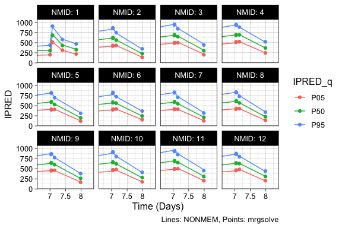

# Setup


```r
knitr::opts_chunk$set(echo = TRUE, fig.width=6, fig.height=4, results.folding=NULL)
knitr::opts_knit$set(root.dir = rprojroot::find_rstudio_root_file())

library(tidyverse)
library(glue)
library(xpose)
library(mrgsolve)
library(xgxr)
library(tidyvpc)

theme_set(theme_linedraw(base_size = 12))

geomean <- function(x){exp(mean(log(x)))}
quibble <- function(x, q = c(0.05, 0.5, 0.95)) {
  tibble("{{ x }}" := quantile(x, q), 
         "{{ x }}_q" := paste0("P",
                               formatC(q * 100, width = 2, format = "d", flag = "0")))
}
# summarize(data, quibble(x))
```


# Notes

Validation worked fine

- The model & data were from:
  - *Nonlinear Mixed‐Effects Model Development and Simulation Using nlmixr and Related R Open‐Source Packages*, Fidler et al., CPT Pharmacometrics Syst Pharmacol. 2019 Sep;8(9):621-633.
  - https://doi.org/10.1002/psp4.12445
- `mrgsolve` version >= 0.10.4 is required

# Import data

## First modify data


```r
df.raw <- read_csv("data/examplomycin.csv")

unique(df.raw$EVID)

df.raw %>% 
  mutate(CMT = ifelse(EVID == 101, 1, 2),
         EVID = ifelse(EVID == 101, 1, 0),
         PHASE = ifelse(TIME < 24, "SD", "MD")) %>% 
  relocate(CMT, .after = DV) %>% 
  rename(NMID = ID) %>% 
  write_csv("data/examplomycin2.csv")
```

## Import modified data


```r
df.nm <- read_csv("data/examplomycin2.csv")
```

```
## Parsed with column specification:
## cols(
##   NMID = col_double(),
##   TIME = col_double(),
##   DV = col_double(),
##   CMT = col_double(),
##   WT = col_double(),
##   SEX = col_double(),
##   AMT = col_double(),
##   EVID = col_double(),
##   PHASE = col_character()
## )
```

```r
df.nm.dose<- filter(df.nm, EVID == 1)
df.nm.obs <- filter(df.nm, EVID == 0)

time_units_dataset = "hours"
time_units_plot    = "days"
```

# Load model file


```r
mod_pk <- mread("mrgsolve/examplomycin_2cmt_covs_2020-07-08.cpp")
```

```
## Building examplomycin_2cmt_covs_2020-07-08_cpp ... done.
```

# Import NONMEM fit


```r
xpdb <- xpose_data(runno = "006", dir = "nm")
```

```
## Warning: Duplicated column names deduplicated: 'DV' => 'DV_1' [21]
```

```r
df.theta <- 
  get_prm(xpdb, transform = FALSE, quiet = TRUE) %>% 
  filter(type == "the") %>% 
  select(name, value) %>% 
  pivot_wider() %>% 
  rename(TVCL = THETA1,
         TVV2 = THETA2,
         TVV3 = THETA3,
         TVQ  = THETA4,
         TVKA = THETA5,
         PROP = THETA6,
         ADD  = THETA7,
         WTCL = THETA11,
         SEXV2= THETA12)

df.eta <- 
  get_data(xpdb, quiet = TRUE) %>% 
  select(NMID, 
         E_CLi = ETA1, 
         E_V2i = ETA2, 
         E_V3i = ETA3, 
         E_Qi  = ETA4, 
         E_KAi = ETA5) %>% 
  distinct()

omega.vec <- 
  get_prm(xpdb, transform = FALSE, quiet = TRUE) %>% 
  filter(type == "ome") %>% 
  pull(value)

d.omat <- 
  omat(group1 = bmat(omega.vec[1:3]), group2 = dmat(omega.vec[4:6]))
```

# Sim with actual dosing record

## Run


```r
df.sim.actdose <-
  df.nm %>% 
  # Add parameter and ETA values
  expand_grid(df.theta) %>% 
  left_join(df.eta, by = "NMID") %>% 
  rename(ID = NMID)


mod_pk.actdose <- 
  mod_pk %>% 
  zero_re() %>% 
  carry_out(AMT, EVID, WT, SEX, a.u.g) %>% 
  obsaug()

mrgsim.pred.actdose <- 
  mod_pk.actdose %>% 
  data_set(select(df.sim.actdose, !starts_with("E_"))) %>%
  mrgsim(end = 200, delta = 1,
         recover = "PHASE")

mrgsim.ipred.actdose <- 
  mod_pk.actdose %>% 
  data_set(df.sim.actdose) %>%
  mrgsim(end = 200, delta = 1,
         recover = "PHASE")


df.mrgsim.pred.actdose <- 
  as_tibble(mrgsim.pred.actdose) %>% 
  rename(NMID = ID,
         PRED = IPRED)

df.mrgsim.ipred.actdose <- 
  as_tibble(mrgsim.ipred.actdose) %>% 
  rename(NMID = ID)
```

## Plot


```r
df.mrgsim.ipred.actdose %>% 
  ggplot(aes(TIME, IPRED)) +
  geom_line() +
  geom_line(data = df.mrgsim.pred.actdose,
            aes(y = PRED),
            linetype = "dashed") +
  geom_point(data = df.nm.obs,
             aes(y = DV)) +
  # Only show the first 12 subjects
  facet_wrap_paginate(~NMID, nrow = 3, ncol = 4, page = 1,
                      labeller = "label_both") +
  xgx_scale_x_time_units(units_dataset = time_units_dataset, 
                         units_plot    = time_units_plot) +
  labs(caption = "Solid line: IPRED, Dashed line: PRED, Circles: Obs")
```

<!-- -->


## Compare between NONMEM and mrgsolve


```r
df.joined <- 
  bind_cols(df.mrgsim.ipred.actdose %>% 
              arrange(NMID, TIME) %>% 
              filter(a.u.g == 0, EVID == 0) %>% 
              select(NMID, TIME, IPRED_MRG = IPRED),
            get_data(xpdb, quiet = TRUE) %>%
              arrange(NMID, TIME) %>%  
              filter(EVID == 0) %>% 
              select(IPRED_NM = IPRED))

df.joined
```

```
## # A tibble: 360 x 4
##     NMID    TIME IPRED_MRG IPRED_NM
##    <dbl>   <dbl>     <dbl>    <dbl>
##  1     1   0.302      173.     173.
##  2     1   2.91       338.     338.
##  3     1   3.14       326.     326.
##  4     1   9.94       138.     138.
##  5     1  18.0        102.     102.
##  6     1 168.         363.     363.
##  7     1 170.         728.     728.
##  8     1 178.         466.     466.
##  9     1 188.         389.     390.
## 10     2   0.438      190.     190.
## # … with 350 more rows
```

```r
qplot(IPRED_MRG, IPRED_NM, data = df.joined) +
  geom_abline(slope = 1, intercept = 0)
```

<!-- -->

# DV comparison including VPC

## Run

### NONMEM

`vpc -samples=500 -auto_bin=auto -dir=vpc_run006_500 -predcorr -nodes=8 run006.mod`


```r
df.nm.vpc.output.raw <-
  read_table("nm/vpc_run006_500/m1/vpc_simulation.1.npctab.dta",
             col_types = cols(.default = col_double()),
             skip = 1) %>% 
  filter(!is.na(ID))

n.reps.vpc <- nrow(df.nm.vpc.output.raw) / nrow(df.nm)

df.nm.vpc.output <- 
  df.nm.vpc.output.raw %>% 
  mutate(REP = rep(1:n.reps.vpc, each = nrow(df.nm))) %>% 
  filter(MDV == 0)

save(df.nm.vpc.output, file = "nm/vpc/vpc.run006.Rdata")
```


```r
load("nm/vpc/vpc.run006.Rdata")

df.nm.vpc.output
```

```
## # A tibble: 180,000 x 6
##       ID   MDV    TIME    DV  PRED   REP
##    <dbl> <dbl>   <dbl> <dbl> <dbl> <int>
##  1     1     0   0.302  173.  161.     1
##  2     1     0   2.91   324.  383.     1
##  3     1     0   3.14   326.  373.     1
##  4     1     0   9.94   166.  162.     1
##  5     1     0  18.0    113.  104.     1
##  6     1     0 168.     281.  309.     1
##  7     1     0 170.     641.  701.     1
##  8     1     0 178.     372.  434.     1
##  9     1     0 188.     294.  331.     1
## 10     2     0   0.438  289.  248.     1
## # … with 179,990 more rows
```

### mrgsolve


```r
n.vpc <- 1000

df.sim.vpc <-
  df.nm %>% 
  # Add parameter values
  expand_grid(df.theta) %>% 
  rename(ID = NMID) %>% 
  # Duplicate all records n.vpc times
  expand_grid(REP = 1:n.vpc) %>% 
  mutate(NMID = ID,
         ID = ID * n.vpc + REP) %>% 
  arrange(REP, NMID, TIME, EVID)

mrgsim.vpc <- 
  mod_pk %>% 
  carry_out(REP, NMID, AMT, EVID, WT, SEX) %>% 
  data_set(df.sim.vpc) %>%
  omat(d.omat) %>% 
  mrgsim(recover = "PHASE")

df.mrgsim.vpc <- 
  as_tibble(mrgsim.vpc) %>% 
  filter(EVID == 0)
```

## Quantiles of DV for each individual


```r
df.nm.vpc.qtile <- 
  df.nm.vpc.output %>% 
  rename(NMID = ID) %>% 
  group_by(NMID, TIME) %>% 
  summarize(quibble(DV),
            n = n(),
            .groups = "drop")

df.vpc.qtile <- 
  df.mrgsim.vpc %>% 
  group_by(NMID, TIME) %>% 
  summarize(quibble(DV),
            n = n(),
            .groups = "drop")
```


```r
df.nm.vpc.qtile %>% 
  ggplot(aes(TIME, DV, group = DV_q, color = DV_q)) +
  geom_line() +
  geom_point(data = df.vpc.qtile) +
  coord_cartesian(xlim = c(0, 25)) +
  xgx_scale_x_time_units(units_dataset = time_units_dataset, 
                         units_plot    = time_units_plot) +
  facet_wrap_paginate(~NMID, nrow = 3, ncol = 4, page = 1,
                      labeller = "label_both") +
  labs(caption = "Lines: NONMEM, Points: mrgsolve")
```

<!-- -->

```r
df.nm.vpc.qtile %>% 
  ggplot(aes(TIME, DV, group = DV_q, color = DV_q)) +
  geom_line() +
  geom_point(data = df.vpc.qtile) +
  coord_cartesian(xlim = c(160, 200)) +
  xgx_scale_x_time_units(units_dataset = time_units_dataset, 
                         units_plot    = time_units_plot) +
  facet_wrap_paginate(~NMID, nrow = 3, ncol = 4, page = 1,
                      labeller = "label_both") +
  labs(caption = "Lines: NONMEM, Points: mrgsolve")
```

<!-- -->

## Generate VPC


```r
d.pred <- 
  df.mrgsim.pred.actdose %>% 
  filter(a.u.g == 0, EVID == 0) %>% 
  pull(PRED)

vpc <- 
  df.nm.obs %>% 
  mutate(PRED = d.pred,
         NTIM = TIME,
         PHASE = factor(PHASE, levels = c("SD", "MD"))) %>% 
  observed(x=TIME, y=DV) %>%
  simulated(df.mrgsim.vpc, y=DV) %>%
  stratify(~PHASE) %>% 
  # binning(bin = NTIM) %>% 
  binning(bin = "breaks", breaks = c(1, 4, 5, 12, 24, 171, 185, 200)) %>% 
  vpcstats()

vpc.nm <- 
  df.nm.obs %>% 
  mutate(PRED = d.pred,
         NTIM = TIME,
         PHASE = factor(PHASE, levels = c("SD", "MD"))) %>% 
  observed(x=TIME, y=DV) %>%
  simulated(df.nm.vpc.output, y=DV) %>%
  stratify(~PHASE) %>% 
  # binning(bin = NTIM) %>% 
  binning(bin = "breaks", breaks = c(1, 4, 5, 12, 24, 171, 185, 200)) %>% 
  vpcstats()


plot(vpc) + coord_cartesian(ylim = c(0, 1000))
```

<!-- -->

```r
plot(vpc.nm) + coord_cartesian(ylim = c(0, 1000))
```

<!-- -->

# IPRED comparison (with ETA resampling)

## Run

### NONMEM


```r
df.nmsim.output.raw <-
  read_table("nm/run006_sim.tab",
             col_types = cols(.default = col_double()),
             skip = 1) %>% 
  filter(!is.na(ID))

n.reps.vpc <- nrow(df.nmsim.output.raw) / nrow(df.nm)

df.nmsim.output <- 
  df.nmsim.output.raw %>% 
  mutate(REP = rep(1:n.reps.vpc, each = nrow(df.nm))) %>% 
  filter(EVID == 0)

save(df.nmsim.output, file = "nm/vpc/nmsim.run006_sim.Rdata")
```


```r
load("nm/vpc/nmsim.run006_sim.Rdata")

df.nmsim.output
```

```
## # A tibble: 180,000 x 15
##       ID  NMID    TIME    DV IPRED   CMT    WT   SEX   AMT  EVID  DV_1  PRED
##    <dbl> <dbl>   <dbl> <dbl> <dbl> <dbl> <dbl> <dbl> <dbl> <dbl> <dbl> <dbl>
##  1     1     1   0.302  216.  220.     2    52     0     0     0  216.  161.
##  2     1     1   2.91   387.  399.     2    52     0     0     0  387.  382.
##  3     1     1   3.14   377.  385.     2    52     0     0     0  377.  372.
##  4     1     1   9.94   172.  172.     2    52     0     0     0  172.  162.
##  5     1     1  18.0    131.  123.     2    52     0     0     0  131.  104.
##  6     1     1 168.     489.  458.     2    52     0     0     0  489.  310.
##  7     1     1 170.     924.  889.     2    52     0     0     0  924.  702.
##  8     1     1 178.     602.  587.     2    52     0     0     0  602.  435.
##  9     1     1 188.     495.  492.     2    52     0     0     0  495.  332.
## 10     2     2   0.438  184.  175.     2    73     1     0     0  184.  248.
## # … with 179,990 more rows, and 3 more variables: RES <dbl>, WRES <dbl>,
## #   REP <int>
```


## Quantile of IPRED for each individual


```r
df.nmsim.ipred.qtile <- 
  df.nmsim.output %>% 
  group_by(NMID, TIME) %>% 
  summarize(quibble(IPRED),
            n = n(),
            .groups = "drop")

df.ipred.qtile <- 
  df.mrgsim.vpc %>% 
  group_by(NMID, TIME) %>% 
  summarize(quibble(IPRED),
            n = n(),
            .groups = "drop")
```


```r
df.nmsim.ipred.qtile %>% 
  ggplot(aes(TIME, IPRED, group = IPRED_q, color = IPRED_q)) +
  geom_line() +
  geom_point(data = df.ipred.qtile) +
  coord_cartesian(xlim = c(0, 25)) +
  xgx_scale_x_time_units(units_dataset = time_units_dataset, 
                         units_plot    = time_units_plot) +
  facet_wrap_paginate(~NMID, nrow = 3, ncol = 4, page = 1,
                      labeller = "label_both") +
  labs(caption = "Lines: NONMEM, Points: mrgsolve")
```

<!-- -->

```r
df.nmsim.ipred.qtile %>% 
  ggplot(aes(TIME, IPRED, group = IPRED_q, color = IPRED_q)) +
  geom_line() +
  geom_point(data = df.ipred.qtile) +
  coord_cartesian(xlim = c(160, 200)) +
  xgx_scale_x_time_units(units_dataset = time_units_dataset, 
                         units_plot    = time_units_plot) +
  facet_wrap_paginate(~NMID, nrow = 3, ncol = 4, page = 1,
                      labeller = "label_both") +
  labs(caption = "Lines: NONMEM, Points: mrgsolve")
```

<!-- -->


# Session info


```r
devtools::session_info()
```

```
## ─ Session info ───────────────────────────────────────────────────────────────
##  setting  value                       
##  version  R version 4.0.2 (2020-06-22)
##  os       macOS Catalina 10.15.6      
##  system   x86_64, darwin17.0          
##  ui       X11                         
##  language (EN)                        
##  collate  en_US.UTF-8                 
##  ctype    en_US.UTF-8                 
##  tz       America/Los_Angeles         
##  date     2020-09-25                  
## 
## ─ Packages ───────────────────────────────────────────────────────────────────
##  package       * version     date       lib source        
##  assertthat      0.2.1       2019-03-21 [1] CRAN (R 4.0.0)
##  backports       1.1.7       2020-05-13 [1] CRAN (R 4.0.0)
##  binom           1.1-1       2014-01-02 [1] CRAN (R 4.0.0)
##  blob            1.2.1       2020-01-20 [1] CRAN (R 4.0.0)
##  broom           0.7.0       2020-07-09 [1] CRAN (R 4.0.2)
##  callr           3.4.3       2020-03-28 [1] CRAN (R 4.0.0)
##  cellranger      1.1.0       2016-07-27 [1] CRAN (R 4.0.0)
##  cli             2.0.2       2020-02-28 [1] CRAN (R 4.0.0)
##  colorspace      1.4-1       2019-03-18 [1] CRAN (R 4.0.0)
##  crayon          1.3.4       2017-09-16 [1] CRAN (R 4.0.0)
##  data.table    * 1.12.8      2019-12-09 [1] CRAN (R 4.0.0)
##  DBI             1.1.0       2019-12-15 [1] CRAN (R 4.0.0)
##  dbplyr          1.4.4       2020-05-27 [1] CRAN (R 4.0.0)
##  desc            1.2.0       2018-05-01 [1] CRAN (R 4.0.0)
##  devtools        2.3.0       2020-04-10 [1] CRAN (R 4.0.0)
##  digest          0.6.25      2020-02-23 [1] CRAN (R 4.0.0)
##  dplyr         * 1.0.2       2020-08-18 [1] CRAN (R 4.0.2)
##  ellipsis        0.3.1       2020-05-15 [1] CRAN (R 4.0.0)
##  evaluate        0.14        2019-05-28 [1] CRAN (R 4.0.0)
##  fansi           0.4.1       2020-01-08 [1] CRAN (R 4.0.0)
##  farver          2.0.3       2020-01-16 [1] CRAN (R 4.0.0)
##  forcats       * 0.5.0       2020-03-01 [1] CRAN (R 4.0.0)
##  fs              1.4.1       2020-04-04 [1] CRAN (R 4.0.0)
##  generics        0.0.2       2018-11-29 [1] CRAN (R 4.0.0)
##  ggforce         0.3.1       2019-08-20 [1] CRAN (R 4.0.0)
##  ggplot2       * 3.3.2       2020-06-19 [1] CRAN (R 4.0.2)
##  glue          * 1.4.1       2020-05-13 [1] CRAN (R 4.0.0)
##  gtable          0.3.0       2019-03-25 [1] CRAN (R 4.0.0)
##  haven           2.3.1       2020-06-01 [1] CRAN (R 4.0.0)
##  hms             0.5.3       2020-01-08 [1] CRAN (R 4.0.0)
##  htmltools       0.5.0       2020-06-16 [1] CRAN (R 4.0.0)
##  httr            1.4.1       2019-08-05 [1] CRAN (R 4.0.0)
##  jsonlite        1.6.1       2020-02-02 [1] CRAN (R 4.0.0)
##  knitr           1.28        2020-02-06 [1] CRAN (R 4.0.0)
##  labeling        0.3         2014-08-23 [1] CRAN (R 4.0.0)
##  lattice         0.20-41     2020-04-02 [1] CRAN (R 4.0.2)
##  lifecycle       0.2.0       2020-03-06 [1] CRAN (R 4.0.0)
##  lubridate       1.7.8       2020-04-06 [1] CRAN (R 4.0.0)
##  magrittr      * 1.5         2014-11-22 [1] CRAN (R 4.0.0)
##  MASS            7.3-51.6    2020-04-26 [1] CRAN (R 4.0.2)
##  Matrix          1.2-18      2019-11-27 [1] CRAN (R 4.0.2)
##  MatrixModels    0.4-1       2015-08-22 [1] CRAN (R 4.0.0)
##  memoise         1.1.0       2017-04-21 [1] CRAN (R 4.0.0)
##  modelr          0.1.8       2020-05-19 [1] CRAN (R 4.0.0)
##  mrgsolve      * 0.10.4      2020-06-19 [1] CRAN (R 4.0.0)
##  munsell         0.5.0       2018-06-12 [1] CRAN (R 4.0.0)
##  pander          0.6.3       2018-11-06 [1] CRAN (R 4.0.0)
##  pillar          1.4.4       2020-05-05 [1] CRAN (R 4.0.0)
##  pkgbuild        1.0.8       2020-05-07 [1] CRAN (R 4.0.0)
##  pkgconfig       2.0.3       2019-09-22 [1] CRAN (R 4.0.0)
##  pkgload         1.1.0       2020-05-29 [1] CRAN (R 4.0.0)
##  png             0.1-7       2013-12-03 [1] CRAN (R 4.0.0)
##  polyclip        1.10-0      2019-03-14 [1] CRAN (R 4.0.0)
##  prettyunits     1.1.1       2020-01-24 [1] CRAN (R 4.0.0)
##  processx        3.4.2       2020-02-09 [1] CRAN (R 4.0.0)
##  ps              1.3.3       2020-05-08 [1] CRAN (R 4.0.0)
##  purrr         * 0.3.4       2020-04-17 [1] CRAN (R 4.0.0)
##  quantreg      * 5.55        2020-04-01 [1] CRAN (R 4.0.0)
##  R6              2.4.1       2019-11-12 [1] CRAN (R 4.0.0)
##  Rcpp            1.0.5       2020-07-06 [1] CRAN (R 4.0.2)
##  RcppArmadillo   0.9.900.3.0 2020-09-03 [1] CRAN (R 4.0.2)
##  readr         * 1.3.1       2018-12-21 [1] CRAN (R 4.0.0)
##  readxl          1.3.1       2019-03-13 [1] CRAN (R 4.0.0)
##  remotes         2.1.1       2020-02-15 [1] CRAN (R 4.0.0)
##  reprex          0.3.0       2019-05-16 [1] CRAN (R 4.0.1)
##  reticulate      1.16        2020-05-27 [1] CRAN (R 4.0.2)
##  rlang           0.4.7       2020-07-09 [1] CRAN (R 4.0.2)
##  rmarkdown       2.3         2020-06-18 [1] CRAN (R 4.0.2)
##  rprojroot       1.3-2       2018-01-03 [1] CRAN (R 4.0.0)
##  rstudioapi      0.11        2020-02-07 [1] CRAN (R 4.0.0)
##  rvest           0.3.5       2019-11-08 [1] CRAN (R 4.0.0)
##  scales          1.1.1       2020-05-11 [1] CRAN (R 4.0.0)
##  sessioninfo     1.1.1       2018-11-05 [1] CRAN (R 4.0.0)
##  SparseM       * 1.78        2019-12-13 [1] CRAN (R 4.0.0)
##  stringi         1.4.6       2020-02-17 [1] CRAN (R 4.0.0)
##  stringr       * 1.4.0       2019-02-10 [1] CRAN (R 4.0.0)
##  testthat        2.3.2       2020-03-02 [1] CRAN (R 4.0.0)
##  tibble        * 3.0.3       2020-07-10 [1] CRAN (R 4.0.2)
##  tidyr         * 1.1.2       2020-08-27 [1] CRAN (R 4.0.2)
##  tidyselect      1.1.0       2020-05-11 [1] CRAN (R 4.0.0)
##  tidyverse     * 1.3.0       2019-11-21 [1] CRAN (R 4.0.2)
##  tidyvpc       * 1.0.0       2020-03-26 [1] CRAN (R 4.0.0)
##  tweenr          1.0.1       2018-12-14 [1] CRAN (R 4.0.0)
##  usethis         1.6.1       2020-04-29 [1] CRAN (R 4.0.0)
##  utf8            1.1.4       2018-05-24 [1] CRAN (R 4.0.0)
##  vctrs           0.3.4       2020-08-29 [1] CRAN (R 4.0.2)
##  withr           2.2.0       2020-04-20 [1] CRAN (R 4.0.0)
##  xfun            0.17        2020-09-09 [1] CRAN (R 4.0.2)
##  xgxr          * 1.0.9       2020-04-14 [1] CRAN (R 4.0.0)
##  xml2            1.3.2       2020-04-23 [1] CRAN (R 4.0.0)
##  xpose         * 0.4.11      2020-07-22 [1] CRAN (R 4.0.2)
##  yaml            2.2.1       2020-02-01 [1] CRAN (R 4.0.0)
## 
## [1] /Library/Frameworks/R.framework/Versions/4.0/Resources/library
```


